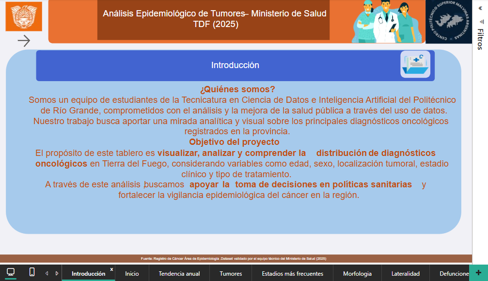
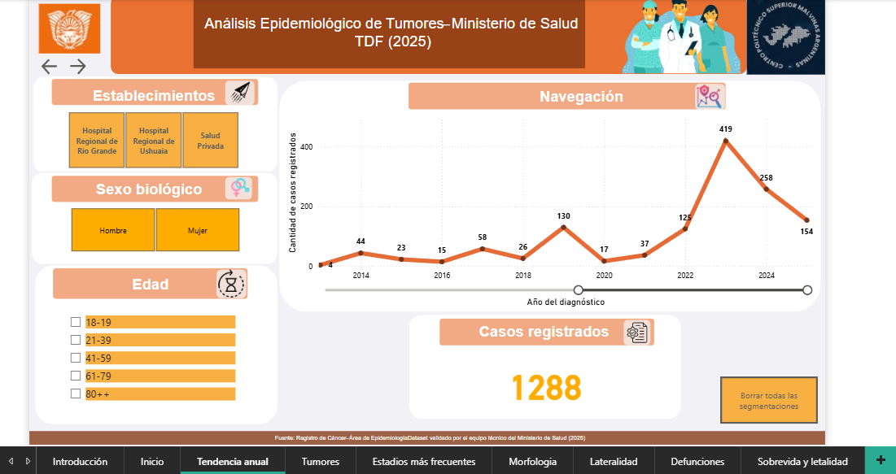
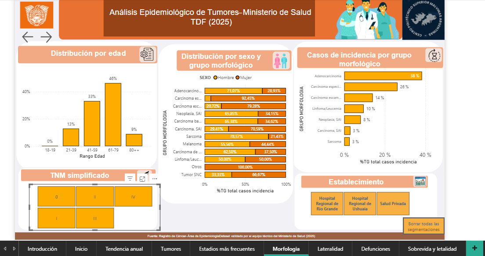
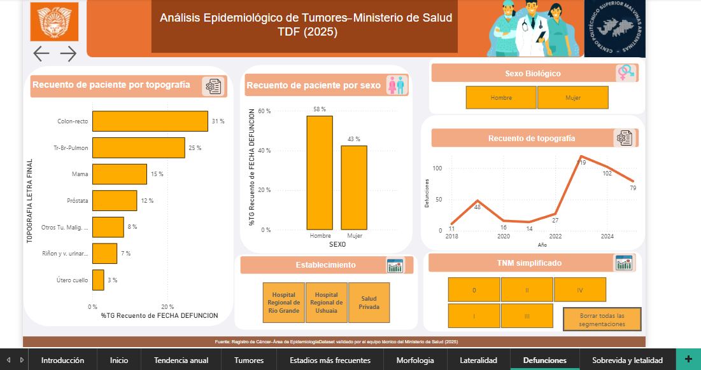
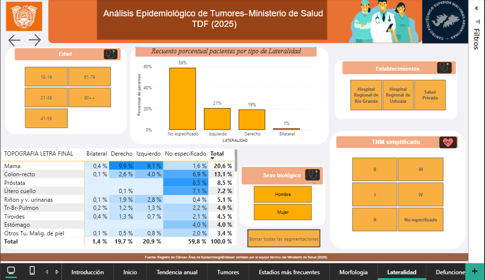
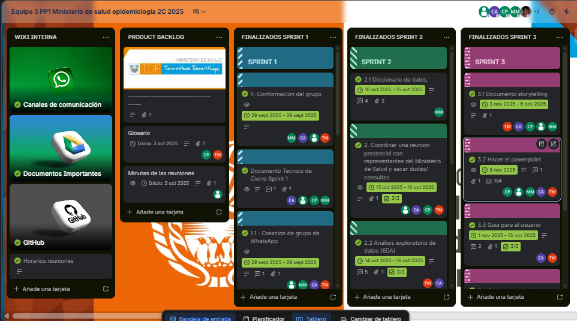
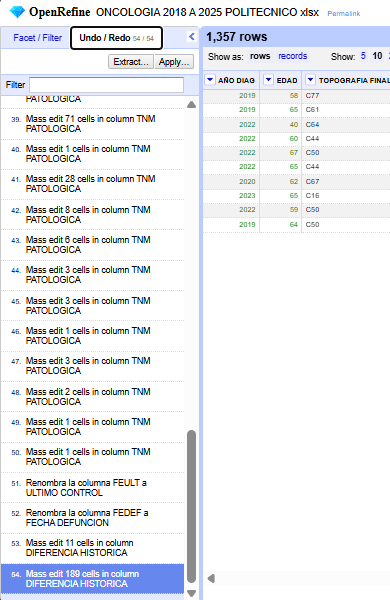

# 🏥 Análisis Epidemiológico Oncológico — Ministerio de Salud TDF

> **Rol:** Analista de Datos · Diseñador de Visualización · Encargado de Comunicación  
> **Organismo:** Dirección de Epidemiología e Información en Salud — Ministerio de Salud, Provincia de Tierra del Fuego  
> **Stack:** Python · Power BI · OpenRefine · GitHub · Metodología Scrum  
> **Período:** 2017–2025 · 1.357 registros oncológicos · 17 variables  
> **Estado:** ✅ Entregado y aprobado — presentado ante directivos del Área de Estadísticas del Ministerio

---

## ¿Por qué importa este proyecto?

La Dirección de Epidemiología de Tierra del Fuego gestiona el Registro Poblacional de Cáncer provincial: un sistema crítico para monitorear estadísticas vitales, coordinar la vigilancia epidemiológica y orientar políticas sanitarias. Sin embargo, los datos históricos del registro presentaban inconsistencias estructurales que impedían su análisis sistemático: columnas con nombres en código interno, estadios TNM no estandarizados, morfologías sin clasificación clínica unificada y valores inválidos acumulados durante años de carga manual.

Este proyecto transformó ese dataset en un recurso analítico usable y construyó sobre él un dashboard interactivo en Power BI para que el equipo de epidemiología pudiera explorar patrones oncológicos de forma autónoma, sin depender de especialistas técnicos para cada consulta. El entregable fue diseñado para ser actualizable: cada vez que el ministerio incorpore nuevos registros, el pipeline Python regenera el dataset limpio y Power BI lo refleja automáticamente.

---

## Objetivos del Análisis

- Identificar la distribución de diagnósticos por **edad, sexo y localización tumoral**
- Analizar los **estadios TNM** más frecuentes al momento del diagnóstico
- Evaluar la relación entre **lateralidad, tipo y morfología** del tumor
- Realizar **análisis de supervivencia y letalidad** según estado al último control
- Explorar correlaciones entre **topografía y morfología**

---

## Dashboard en Power BI

El tablero cuenta con 9 páginas interactivas y segmentadores cruzados por establecimiento, sexo, edad y año de diagnóstico.

### Introducción y modelo de datos

*Página introductoria del dashboard con el panel de campos modelados en Power BI (17 variables procesadas).*

### Tendencia anual de casos (2014–2025)

*Crecimiento sostenido de registros con pico de 419 casos en 2023. Total histórico: 1.288 registros con edad válida.*

### Distribución morfológica y por sexo

*Adenocarcinoma representa el 38% de los casos. El carcinoma especializado domina en mujeres (92,45%). Clasificación propia construida sobre códigos ICD-O-3.*

### Análisis de defunciones

*Colon-recto y tráquea-bronquio-pulmón concentran la mayor mortalidad. Los hombres presentan una tasa de defunción del 58% vs 43% en mujeres.*

### Lateralidad por topografía

*El 59,8% de los casos tiene lateralidad "No especificado", señalando una oportunidad clave de mejora en la calidad del registro clínico provincial.*

---

## Proceso ETL

Pipeline completo desarrollado en 3 sprints con metodología Scrum:

```
Sprint 1 (sept–oct 2025)  →  Organización, carta de presentación, Gantt, GitHub, roles
Sprint 2 (oct–nov 2025)   →  EDA, diccionario de datos, limpieza y normalización
Sprint 3 (nov 2025)       →  Visualizaciones Power BI, storytelling, guía de usuario, entrega
```

### Gestión del proyecto — Trello

*Tablero Scrum con los 3 sprints finalizados: conformación del equipo, proceso ETL y entrega final con storytelling.*

### Trazabilidad del ETL — OpenRefine

*54 operaciones registradas en OpenRefine: renombrado de columnas, limpieza masiva de valores inválidos y normalización de variables categóricas. Cada transformación es reproducible y auditable.*

---

## Principales Hallazgos

> *Información presentada ante las autoridades del Ministerio de Salud TDF en el marco de la práctica profesionalizante.*

| Dimensión | Hallazgo |
|---|---|
| **Tendencia** | Crecimiento sostenido de casos con pico en 2023 (419 registros) |
| **Topografía** | Mama, colon-recto y próstata son los tumores más frecuentes |
| **Grupo etario** | El 46% de los diagnósticos corresponde al rango 61–79 años |
| **Estadios TNM** | La mayoría se concentra en estadios I y II (detección temprana) |
| **Morfología dominante** | Adenocarcinoma: 38% del total de casos clasificados |
| **Distribución por sexo** | Mama predomina en mujeres; colon y próstata en hombres |
| **Sector** | 76% de los casos proviene de hospitales públicos vs 24% privado |
| **Calidad del registro** | 59,8% de casos sin lateralidad especificada → área de mejora crítica |
| **Letalidad** | Carcinoma SAI presenta las tasas más elevadas, posiblemente por diagnóstico tardío |

---

## Herramientas y Stack Técnico

| Herramienta | Uso |
|---|---|
| **Python + Pandas** | ETL: renombrado, limpieza, clasificación morfológica ICD-O-3 |
| **OpenRefine** | Limpieza interactiva con trazabilidad de 54 operaciones |
| **Power BI** | Dashboard interactivo de 9 páginas con segmentadores cruzados |
| **GitHub** | Control de versiones del código y documentación |
| **Trello** | Gestión del proyecto con metodología Scrum (3 sprints) |
| **Google Drive + Discord** | Coordinación y documentación del equipo |

---

## Script de Actualización del Dataset

El script `etl_oncologia.py` permite actualizar el análisis cuando el ministerio incorpore nuevos registros anuales. No contiene datos — opera sobre el archivo `.xlsx` provisto por el organismo.

```python
# Uso
pip install pandas openpyxl
python etl_oncologia.py
# Output: data/oncologia_procesado.xlsx → listo para recargar en Power BI
```

**Pipeline de 5 pasos:**
1. `load_data()` — carga el Excel original
2. `rename_columns()` — traduce códigos internos a nombres legibles
3. `clean_columns()` — normaliza TNM, lateralidad, comportamiento y año de diagnóstico
4. `filter_age()` — filtra registros fuera del rango etario válido (18–110)
5. `classify_morphology()` — asigna grupo clínico según código ICD-O-3

---

## Estructura del Repositorio

```
02_oncologia_ministerio_salud_tdf/
├── README.md
├── etl_oncologia.py
├── screenshots/
│   ├── 01_introduccion.png
│   ├── 02_tendencia_anual.png
│   ├── 03_morfologia.png
│   ├── 04_defunciones.png
│   ├── 05_lateralidad.png
│   ├── 06_trello_sprints.png
│   └── 07_openrefine_trazabilidad.png
└── docs/
    └── storytelling_epidemiologia_tdf_2025.pdf
```

---

## Consideraciones sobre Confidencialidad

Este proyecto fue realizado en el marco de una Práctica Profesionalizante formal (PP1) bajo acuerdo de confidencialidad con el Ministerio de Salud de la Provincia de Tierra del Fuego — Acta Acuerdo Individual, septiembre 2025. **El dataset de pacientes no está incluido en este repositorio** por contener información sanitaria protegida. Se publican únicamente el código de transformación, la documentación técnica del proceso y los hallazgos en forma estadística agregada, tal como fueron presentados ante las autoridades del organismo.

---

## Equipo

Proyecto desarrollado en equipo en el marco de la **Tecnicatura Superior en Ciencia de Datos e Inteligencia Artificial** — C.E.T.N.S. Malvinas Argentinas, Río Grande, Tierra del Fuego (2025).

*Tutores académicos: Lic. Federico Magaldi · Ing. Silvana Páez Jiménez · Lic. Martín Mirabete*  
*Organismo co-formador: Dirección de Epidemiología e Información en Salud — Ministerio de Salud TDF*
